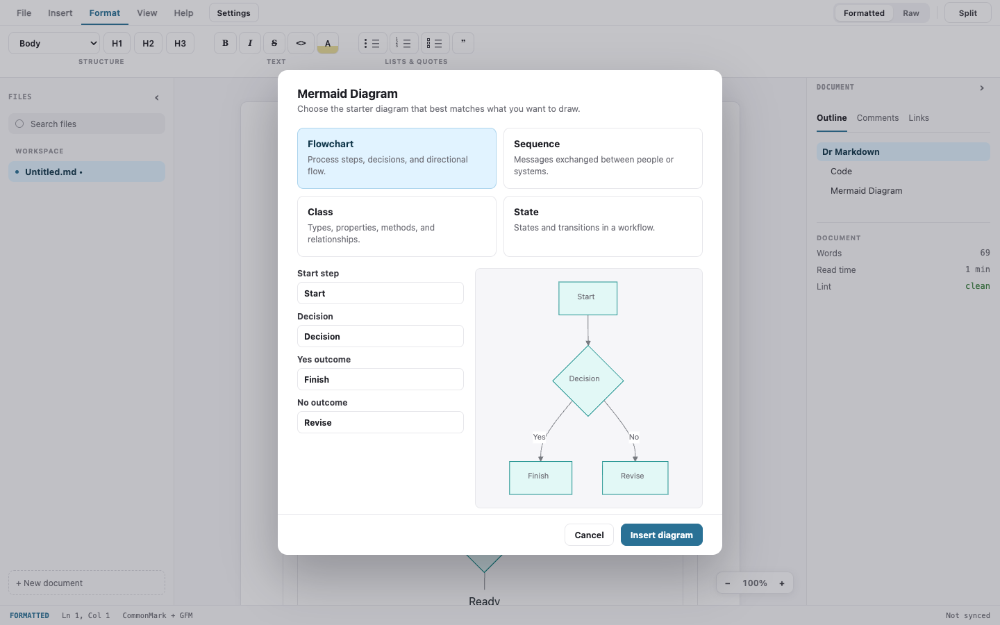

# Dr Markdown

[](LICENSE)
[](go.mod)
[](#architecture)
[](#building--installing-macos)
[](#architecture)
[](https://github.com/robot-accomplice/dr-markdown/issues)

Dr Markdown is a native WYSIWYG markdown editor. A Go shell built directly on AppKit and WebKit, with no application framework, drives a real editing surface: Milkdown Crepe on ProseMirror, CodeMirror for raw mode, both vendored as self-contained ESM bundles.

As of v0.6.0 the running application has **no third-party dependency at all.** The window, the webview, the asset scheme, the menu bar and every native dialog are written against the system frameworks. `go.mod` carries chromedp for the tests and two `golang.org/x` modules; nothing else ships.

## What this is for

**WYSIWYG is the defining purpose of this editor.** Everything in Formatted mode must be editable in
place. If a construct renders but cannot be edited there, that is a defect, not a design choice.
Recorded as a project rule in `docs/architext/data/rules.json`.

> ## ⚠️ Caution: WYSIWYG editing rewrites your file
>
> **Editing a document in the WYSIWYG surface does not preserve your markdown byte-for-byte.** The surface parses markdown into ProseMirror's document model and re-serializes the whole document on save, so anything the model cannot represent is rewritten. Because an edit replaces the entire buffer, **one keystroke can change lines you never touched.**
>
> Measured on the current build, WYSIWYG editing will:
>
> - rewrite two-space hard breaks to `\`, convert indented code blocks to fenced ones, and wrap bare URLs as `<autolinks>`
> - decode HTML entities (`&amp;` and `&copy;` come back as `&` and `©`), strip trailing whitespace, collapse runs of blank lines, and normalize a tab after a list marker to a space
> - reflow table padding, and shorten a closing `##` to match its heading's depth (`# H ##` → `# H #`)
>
> Inline HTML is **preserved**: `<b>`, `<span>`, `<kbd>`, comments and block-level `<div>` all round-trip byte-identically.
>
> **If the exact bytes matter, edit in Raw mode (⌘/Ctrl-R).** A Hugo or Jekyll site, an Obsidian vault, anything under version control. Raw mode preserves every construct listed above.
>
> **Fixed in v0.5.0:** link reference definitions are preserved, including unused ones, and the reference syntax that used them is restored rather than inlined. Bullet characters, ordered-list markers (including lists that repeat `1.` instead of counting up), setext headings, fence characters, thematic-break style and closing ATX hashes are now taken from the document itself instead of being normalized. A document with mixed styles keeps its majority style. A document that ended in a list or a footnote block no longer gains a trailing blank line. GFM footnote definitions are no longer duplicated on every save, a defect that grew the file by one copy each time.
>
> **Fixed in v0.4.1:** inline `<br>` is no longer deleted (in v0.4.0 it joined the words either side of it), and CRLF line endings now survive an edit instead of rewriting the whole file. Both were narrow bugs rather than the architectural limit this caution originally claimed. The correction is recorded in the v0.4.0 release notes.
>
> The remaining items follow from the vendored editor re-serializing the whole document. They are measured in `e2e/fidelity_test.go`, which fails if any of it changes, and the route to closing them is scoped in [docs/decisions/2026-08-08-markdown-fidelity-scope.md](docs/decisions/2026-08-08-markdown-fidelity-scope.md).
>
> **Also fixed:** opening a document whose first block is a list no longer marks it modified without an edit from you. That was the same root cause as the trailing blank line: the re-serialized text differed from the file by one newline, so the document looked changed the moment it opened, and quitting offered to save it.

**Why?** Typora set the bar for distraction-free markdown editing, then went closed and paid. Dr Markdown is the open-source answer: MIT licensed, native via the OS webview (no Electron), and built with zero Node.js anywhere, at development time, build time or runtime. If you have Go, you can build it.

## Features

### Available today

- WYSIWYG editing of GitHub-flavored markdown: tables, task lists, strikethrough, and syntax-highlighted code blocks (via Milkdown Crepe's built-ins)
- Raw and split markdown modes with formatted preview/source switching
- Native syntax highlighting for raw markdown and language-tagged fenced code blocks
- Mermaid Diagram rendering plus a guided Mermaid starter assistant
- Contextual table, code-block language, diagram, and image controls on the document surface
- Image import from the ribbon or by dropping files onto the window, copied into a `<document>.assets/` folder and referenced by relative path so the markdown stays portable
- Image width, alt text, replace, reveal-in-Finder, and delete controls on the selected image; a missing asset renders as a visible broken state rather than blank space
- Persistent settings for document font, code font, ligatures, editor width, default mode, and format-on-save
- Recent markdown documents on the start screen, backed by native preference storage
- Print and PDF export through the native print dialog path
- Native open/save dialogs, Recent Files on the start screen, and `.md` files open from Finder by double-click, drag onto the Dock icon, or Open With
- Atomic saves for documents *and* preferences. A crashed write never leaves a truncated file, and an unreadable preference store is quarantined and replaced with defaults rather than stopping the app from starting
- Dirty tracking with an unsaved-changes close guard and an open-over-dirty guard
- A round-trip corpus (markdown → WYSIWYG → markdown) driven by chromedp, comparing the editor's own serialized output against the fixture, verified to fail when the serializer is broken
- macOS packaging: `tools/build-macos.sh` produces a `.app` and a distributable `.dmg` with a custom icon. The script performs **no code signing at all**. The ad-hoc signature on the binary is a linker artifact rather than a build step, so the app is neither Developer ID signed nor notarized, and Gatekeeper will flag it on any machine but the build host (see [Known limitations](#known-limitations))

### On the roadmap

- Comments and review workflow
- Direct PDF/HTML export artifacts beyond the OS print dialog path
- Sharing, sync/Git, and extensions surfaces
- Developer ID signing, notarization, and Windows/Linux packaging

## Screenshots

Screenshots are generated from the checked-in frontend with:

```sh
go run ./tools/screenshots
```

Run that command whenever a UI-facing fix changes layout, chrome, controls, or
visible editor behavior, and commit the refreshed files under
`docs/assets/screenshots/`.

### Start screen


### Formatted editor


### Raw editor


### Split editor


### Diagram assistant



### Settings


## Download

Prebuilt macOS builds are on the [releases page](https://github.com/robot-accomplice/dr-markdown/releases/latest):

| file | for |
| --- | --- |
| `dr-markdown-<version>-macos-universal.dmg` | any Mac, Apple Silicon and Intel |
| `dr-markdown-<version>-macos-arm64.dmg` | Apple Silicon only, roughly half the size |

**Builds are unsigned and un-notarized**, so Gatekeeper will refuse to open the app on any machine but
the one that built it. Open it once, dismiss the warning, then go to **System Settings → Privacy &
Security** and choose **Open Anyway**. The older right-click → Open shortcut no longer works for
blocked apps on macOS 15 (Sequoia) and later.

**Windows and Linux are not built.** The code is platform-aware and CI runs the full suite on Linux,
but no artifact is produced for either. See [Known limitations](#known-limitations).

## Getting started

Prerequisites:

- Go 1.26+
- Xcode command line tools (cgo builds against AppKit and WebKit)
- Chrome (for the chromedp-based e2e tests)
- macOS (Windows and Linux have no host; see [Known limitations](#known-limitations))

```sh
go test ./...        # unit + round-trip corpus + e2e
go run .             # run the app

# Host verification. These drive a real native window, so they cannot run in
# CI and are a manual step on a Mac.
go run . -gates      # boot, bound call, panic rejection, events, drop, round trip
go run . -walk       # 40 checks across the whole UI surface
go run . -menu       # the menu bar exists and steals no editor shortcut
go run . -doc FILE   # run any markdown file through the editor and diff it
```

## Building & installing (macOS)

```sh
tools/build-macos.sh                # darwin/arm64 build + DMG
tools/build-macos.sh --universal    # universal binary (needs both-arch CGO toolchains)
tools/build-macos.sh --install      # also copies the .app to /Applications
```

Outputs:

- `build/bin/Dr Markdown.app`, the app bundle
- `build/dr-markdown.dmg`, which you drag to Applications

Builds carry only the linker's ad-hoc signature. They are neither Developer ID signed nor notarized, so on any machine but the build host Gatekeeper will refuse to open the app.

To run it anyway: open it once, dismiss the warning, then go to **System Settings → Privacy & Security** and choose **Open Anyway**. The older right-click → Open shortcut no longer works for blocked apps on macOS 15 (Sequoia) and later. Developer ID signing and notarization are future work.

## Architecture

Three layers, no Node anywhere:

1. **Go shell.** An `NSWindow` and `WKWebView` built directly on AppKit and WebKit, with native
   dialogs, atomic file I/O and dirty-state guards. Everything the application asks of the operating
   system goes through one interface, `hostPort`; only `host_darwin.go` and `host_darwin.m` reach the
   OS, and a test enforces that by refusing any other file that imports `"C"`.
2. **Vendored ESM bundles.** Milkdown Crepe and CodeMirror, pre-bundled once and committed; the app loads them as-is.
3. **Hand-written app JS.** The glue: mode switching, load/save plumbing, dirty tracking.

Markdown on disk is the source of truth, and the chromedp round-trip corpus in `testdata/roundtrip` is the correctness gate: if a fixture doesn't round-trip, the change doesn't land. The corpus covers the constructs the WYSIWYG surface preserves; the constructs it **rewrites** are recorded separately in `e2e/fidelity_test.go` and summarized in the caution at the top of this file. Neither file is a claim of completeness: markdown the corpus has never been shown is markdown whose fidelity is unknown.

## Tech stack

| Component | Version |
| --- | --- |
| Go | 1.26.5 |
| Application framework | none |
| Milkdown Crepe | 7.22.0 |
| CodeMirror | 6.0.2 |
| Highlight.js | 11.11.1 |
| Mermaid | 11.6.0 |
| chromedp (e2e) | v0.16.0 |

## Known limitations

- **WYSIWYG editing respells some markdown. See the caution at the top of this file. Use Raw mode when the exact bytes matter.** Nothing is deleted any more: inline `<br>` and CRLF were fixed in v0.4.1, and link reference definitions plus footnote duplication in v0.5.0. 38 of 49 surveyed CommonMark and GFM constructs now round-trip byte-identically, measured by `e2e/fidelity_survey_test.go`.
- Saving refuses to overwrite a file that changed on disk since the app last read or wrote it, and asks before replacing it. The check re-reads the file on every save, which is part of why large documents are slow.
- Saving replaces the file via an atomic rename, which breaks hard links to it. Extended attributes such as Finder tags are preserved, and a read-only file is refused rather than replaced.
- Large documents are slow: roughly 4 s to open a 140 KB file and 10 s for 280 KB, with no progress indicator and no way to cancel. There is no size limit.
- Builds are unsigned and un-notarized, so macOS Gatekeeper and Windows SmartScreen will both warn. On macOS 15 and later, approve it under System Settings → Privacy & Security → Open Anyway.
- **Windows and Linux have no host.** The package compiles everywhere and CI runs the full suite on
  Linux, but `host_unsupported.go` refuses at startup off macOS. Neither platform was ever built
  before either. A Linux host is the cheaper of the two, since WebKitGTK is a C API that maps closely
  onto what macOS needed, while Windows is dominated by WebView2's COM interop.
- **A crash is recorded, but the operation that crashed does not recover.** Every method the frontend
  calls, and the three host lifecycle callbacks, write a panic, with operation, message, stack and build
  version, into the version-stamped event trail beside the preference store, and show a dialog naming
  the operation. Every panic is recorded; the dialog appears **once per session**, because a panic on a
  path the editor calls repeatedly would otherwise put the app behind a modal you cannot type past.
  **A panicking call now settles.** The dispatcher recovers the panic and rejects the frontend's
  promise with its message, so the caller sees an error instead of waiting forever. That was
  [#61](https://github.com/robot-accomplice/dr-markdown/issues/61), which could not be fixed while the
  dispatch belonged to a framework. A panic in a lifecycle callback still ends the process, and a
  panic raised before the app is constructed still leaves nothing behind
  ([#62](https://github.com/robot-accomplice/dr-markdown/issues/62)).
- Code-block hover/right-click language editing targets rendered fenced blocks; deeper cursor-aware block editing is still future work.
- Direct PDF file generation is not implemented; PDF export uses the OS print dialog's Save as PDF path.
- Images must be inserted into a saved document. An unsaved document has no location to resolve a portable relative asset path against, so the import is refused up front.
- Image sizing is written as an `` tag because CommonMark has no size syntax; clearing the width restores plain ``.
- Moving a markdown file without its `.assets` folder is detected and shown as a missing asset, but not repaired; asset folders are not garbage collected when an image is deleted from the document.
- Raw/Split marker hiding preserves source caret alignment by hiding marker glyph visibility rather than reflowing source text.
- Native-dialog flows (open/save/dirty guards) have manual checks pending beyond the automated corpus.

## Contributing

PRs welcome. `go test ./...` must stay green, and every fixture in the round-trip corpus must keep round-tripping. Hard constraint: no Node.js toolchain additions. The vendored ESM bundles are refreshed by maintainers via `tools/vendor.sh`, never by contributors at build time.

## License

[MIT](LICENSE)
