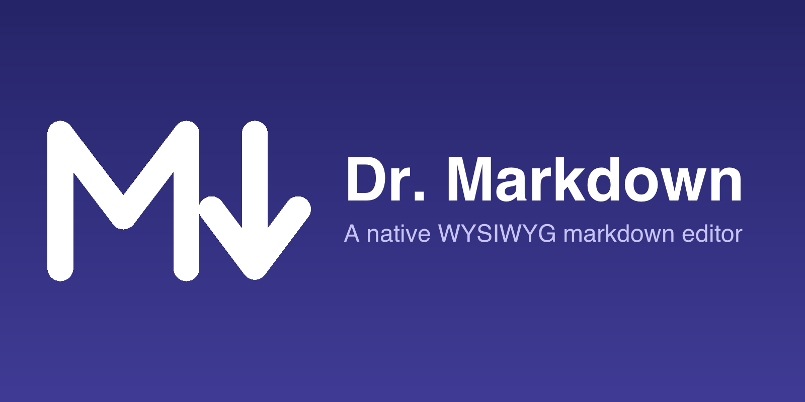
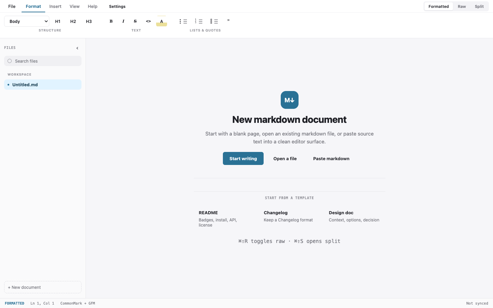
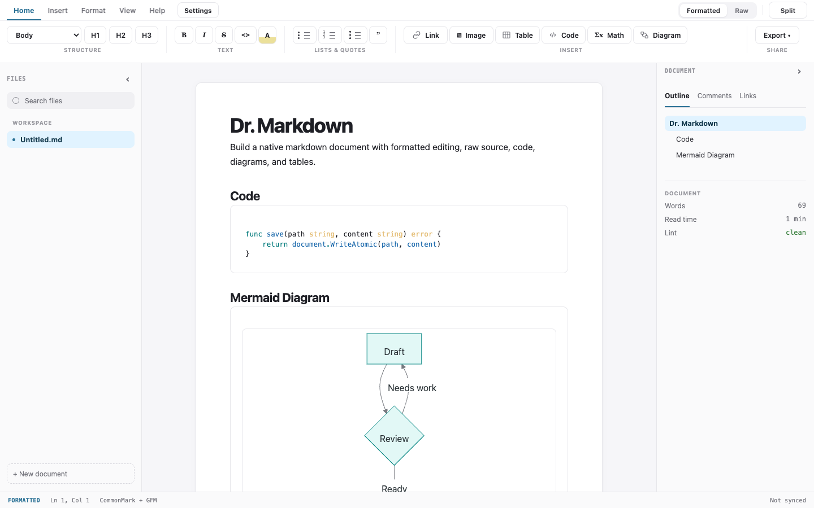
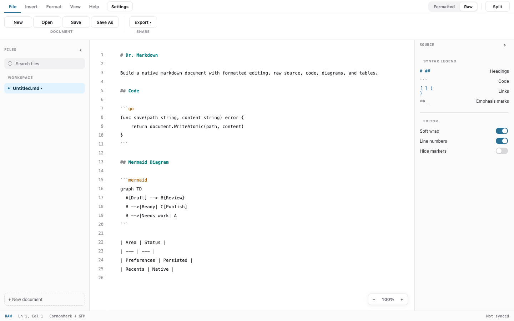
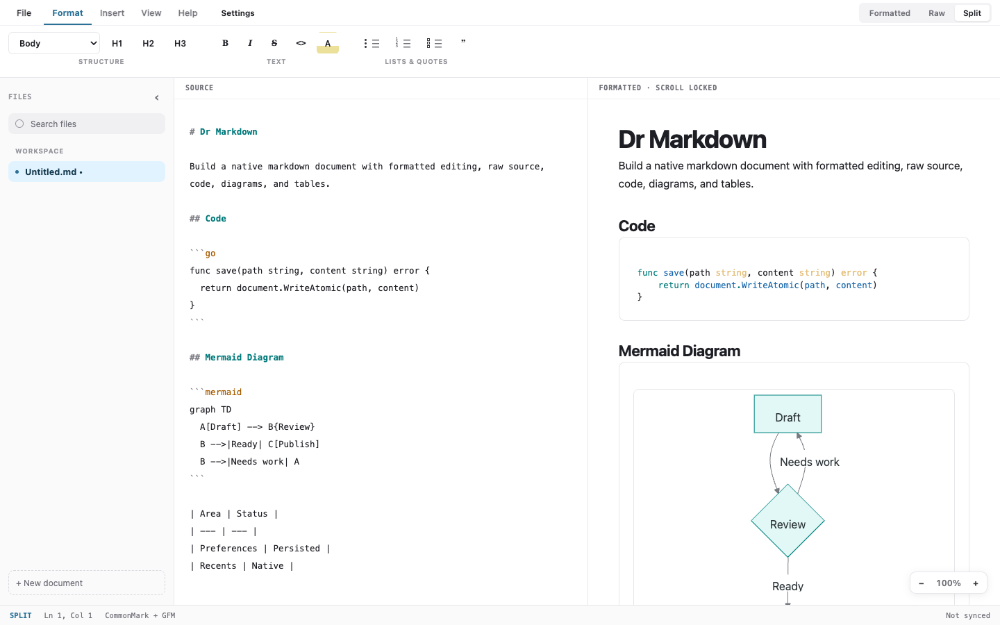
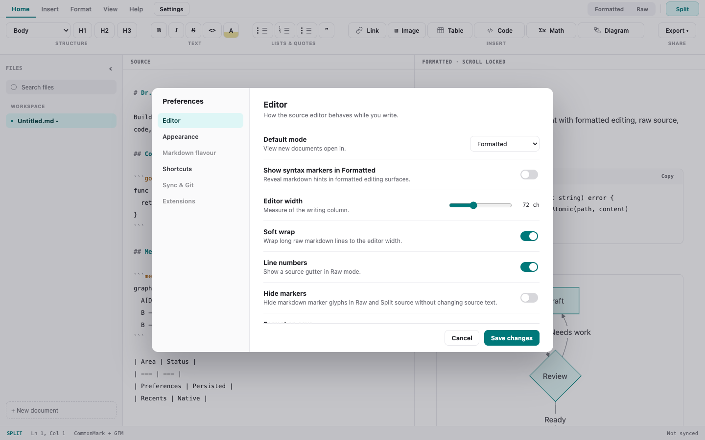

# Dr. Markdown, .MD

[](LICENSE)
[](go.mod)
[](https://wails.io)
[](#building--installing-macos)
[](#architecture)
[](https://github.com/robot-accomplice/dr-markdown/issues)

Dr. Markdown is a native WYSIWYG markdown editor. It pairs a Go shell (Wails) with a real editing surface — Milkdown Crepe on ProseMirror, CodeMirror for raw mode — vendored as self-contained ESM bundles.

> ## ⚠️ Caution: WYSIWYG editing rewrites your file
>
> **Editing a document in the WYSIWYG surface does not preserve your markdown byte-for-byte.** The surface parses markdown into ProseMirror's document model and re-serializes the whole document on save, so anything the model cannot represent is rewritten — and because an edit replaces the entire buffer, **one keystroke can change lines you never touched.**
>
> Measured on the current build, WYSIWYG editing will:
>
> - **delete link reference definitions** and inline the links that used them; unused definitions are dropped outright
> - rewrite two-space hard breaks to `\`, `-`/`+` bullets to `*`, setext headings to ATX, indented code to fenced, `~~~` fences to ```` ``` ````, and `---` breaks to `***`
> - strip closing `##` from ATX headings, strip trailing whitespace, and reflow table padding
>
> Inline HTML is **preserved** — `<b>`, `<span>`, `<kbd>`, comments and block-level `<div>` all round-trip byte-identically.
>
> **If the exact bytes matter — a Hugo or Jekyll site, an Obsidian vault, anything under version control — edit in Raw mode (⌘/Ctrl-R).** Raw mode preserves every construct listed above.
>
> **Fixed since v0.4.0**, and shipping in the next release: inline `<br>` is no longer deleted (it used to join the words either side of it), and CRLF line endings now survive an edit instead of rewriting the whole file. Both were narrow bugs rather than the architectural limit this caution originally claimed — the correction is recorded in the v0.4.0 release notes.
>
> The remaining items follow from the vendored editor re-serializing the whole document. They are measured in `e2e/fidelity_test.go`, which fails if any of it changes, and the route to closing them is scoped in [docs/decisions/2026-08-08-markdown-fidelity-scope.md](docs/decisions/2026-08-08-markdown-fidelity-scope.md).
>
> Related: opening a document whose first block is a list currently marks it modified without any edit from you, so quitting offers to save the re-serialized text. Choose **Don't Save** unless you meant to change it.

**Why?** Typora set the bar for distraction-free markdown editing, then went closed and paid. Dr. Markdown is the open-source answer: MIT licensed, native via the OS webview (no Electron), and built with zero Node.js anywhere — not at development time, not at build time, not at runtime. If you have Go, you can build it.

## Features

### Available today

- WYSIWYG editing of GitHub-flavored markdown: tables, task lists, strikethrough, and syntax-highlighted code blocks (via Milkdown Crepe's built-ins)
- Raw and split markdown modes with formatted preview/source switching
- Native syntax highlighting for raw markdown and language-tagged fenced code blocks
- Mermaid Diagram rendering plus a guided Mermaid starter assistant
- Contextual table, code-block language, diagram, and image controls on the document surface
- Image import from the ribbon or by dropping files onto the window, copied into a `<document>.assets/` folder and referenced by relative path so the markdown stays portable
- Image width, alt text, replace, reveal-in-Finder, and delete controls on the selected image; a missing asset renders as a visible broken state rather than blank space
- Persistent settings for document font, code font, ligatures, editor width, default mode, and format-on-save
- Recent markdown documents on the start screen, backed by native preference storage
- Print and PDF export through the native print dialog path
- Native open/save dialogs; files associate with the app on macOS
- Atomic saves for documents *and* preferences — a crashed write never leaves you a truncated file, and an unreadable preference store is quarantined and replaced with defaults rather than stopping the app from starting
- Dirty tracking with an unsaved-changes close guard and an open-over-dirty guard
- A round-trip corpus (markdown → WYSIWYG → markdown) driven by chromedp, comparing the editor's own serialized output against the fixture — verified to fail when the serializer is broken
- macOS packaging: `tools/build-macos.sh` produces a `.app` and a distributable `.dmg` with a custom icon. The script performs **no code signing at all** — the ad-hoc signature on the binary is a linker artifact, not a build step — so it is neither Developer ID signed nor notarized and Gatekeeper will flag it on any machine but the build host (see [Known limitations](#known-limitations))

### On the roadmap

- Comments and review workflow
- Direct PDF/HTML export artifacts beyond the OS print dialog path
- Sharing, sync/Git, and extensions surfaces
- Developer ID signing, notarization, and Windows/Linux packaging

## Screenshots

Screenshots are generated from the checked-in frontend with:

```sh
go run ./tools/screenshots
```

Run that command whenever a UI-facing fix changes layout, chrome, controls, or
visible editor behavior, and commit the refreshed files under
`docs/assets/screenshots/`.

### Start screen



### Formatted editor



### Raw editor



### Split editor



### Settings



## Getting started

Prerequisites:

- Go 1.26+
- Wails CLI v2.13.0: `go install github.com/wailsapp/wails/v2/cmd/wails@v2.13.0`
- Chrome (for the chromedp-based e2e tests)
- macOS (only for the packaging step)

```sh
go test ./...   # unit + round-trip corpus + e2e
wails dev       # live-reload development build
```

## Building & installing (macOS)

```sh
tools/build-macos.sh                # darwin/arm64 build + DMG
tools/build-macos.sh --universal    # universal binary (needs both-arch CGO toolchains)
tools/build-macos.sh --install      # also copies the .app to /Applications
```

Outputs:

- `build/bin/dr-markdown.app` — the app bundle
- `build/dr-markdown.dmg` — drag the app to Applications and you're done

Builds carry only the linker's ad-hoc signature — they are neither Developer ID signed nor notarized — so on any machine but the build host Gatekeeper will refuse to open the app.

To run it anyway: open it once, dismiss the warning, then go to **System Settings → Privacy & Security** and choose **Open Anyway**. The older right-click → Open shortcut no longer works for blocked apps on macOS 15 (Sequoia) and later. Developer ID signing and notarization are future work.

## Architecture

Three layers, no Node anywhere:

1. **Go shell** — Wails v2 window, native dialogs, atomic file I/O, dirty-state guards.
2. **Vendored ESM bundles** — Milkdown Crepe and CodeMirror, pre-bundled once and committed; the app loads them as-is.
3. **Hand-written app JS** — the glue: mode switching, load/save plumbing, dirty tracking.

Markdown on disk is the source of truth, and the chromedp round-trip corpus in `testdata/roundtrip` is the correctness gate — if a fixture doesn't round-trip, the change doesn't land. The corpus covers the constructs the WYSIWYG surface preserves; the constructs it **rewrites** are recorded separately in `e2e/fidelity_test.go` and summarized in the caution at the top of this file. Neither file is a claim of completeness: markdown the corpus has never been shown is markdown whose fidelity is unknown. Full design notes: [docs/superpowers/specs/2026-08-05-dr-markdown-design.md](docs/superpowers/specs/2026-08-05-dr-markdown-design.md).

## Tech stack

| Component | Version |
| --- | --- |
| Go | 1.26.5 |
| Wails | v2.13.0 |
| Milkdown Crepe | 7.22.0 |
| CodeMirror | 6.0.2 |
| Highlight.js | 11.11.1 |
| Mermaid | 11.6.0 |
| chromedp (e2e) | v0.16.0 |

## Known limitations

- **WYSIWYG editing rewrites some markdown, and deletes link reference definitions — see the caution at the top of this file. Use Raw mode when the exact bytes matter.** Inline `<br>` deletion and CRLF rewriting are fixed since v0.4.0.
- There is no check that a file changed on disk since you opened it. If another program (a `git pull`, a sync client, a second window) writes the file while it is open, saving overwrites those changes without warning.
- Saving replaces the file via an atomic rename, which breaks hard links to it and drops extended attributes such as Finder tags. A read-only file can still be replaced this way, because the rename needs permission on the directory rather than the file.
- Large documents are slow: roughly 4 s to open a 140 KB file and 10 s for 280 KB, with no progress indicator and no way to cancel. There is no size limit.
- Builds are unsigned and un-notarized, so macOS Gatekeeper and Windows SmartScreen will both warn. On macOS 15 and later, approve it under System Settings → Privacy & Security → Open Anyway.
- Code-block hover/right-click language editing targets rendered fenced blocks; deeper cursor-aware block editing is still future work.
- Direct PDF file generation is not implemented; PDF export uses the OS print dialog's Save as PDF path.
- Images must be inserted into a saved document — an unsaved document has no location to resolve a portable relative asset path against, so the import is refused up front.
- Image sizing is written as an `` tag because CommonMark has no size syntax; clearing the width restores plain ``.
- Moving a markdown file without its `.assets` folder is detected and shown as a missing asset, but not repaired; asset folders are not garbage collected when an image is deleted from the document.
- Raw/Split marker hiding preserves source caret alignment by hiding marker glyph visibility rather than reflowing source text.
- Native-dialog flows (open/save/dirty guards) have manual checks pending beyond the automated corpus.

## Contributing

PRs welcome. `go test ./...` must stay green, and every fixture in the round-trip corpus must keep round-tripping. Hard constraint: no Node.js toolchain additions — the vendored ESM bundles are refreshed by maintainers via `tools/vendor.sh`, never by contributors at build time.

## License

[MIT](LICENSE)
